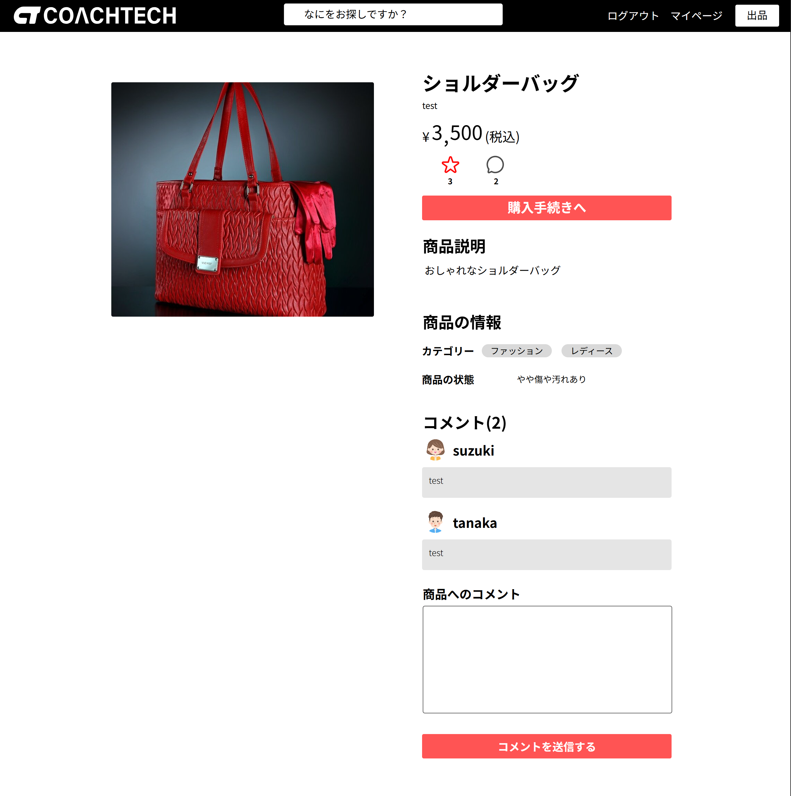
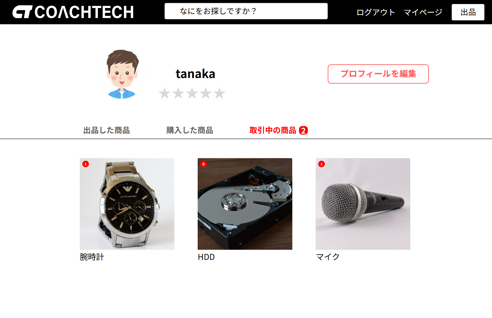
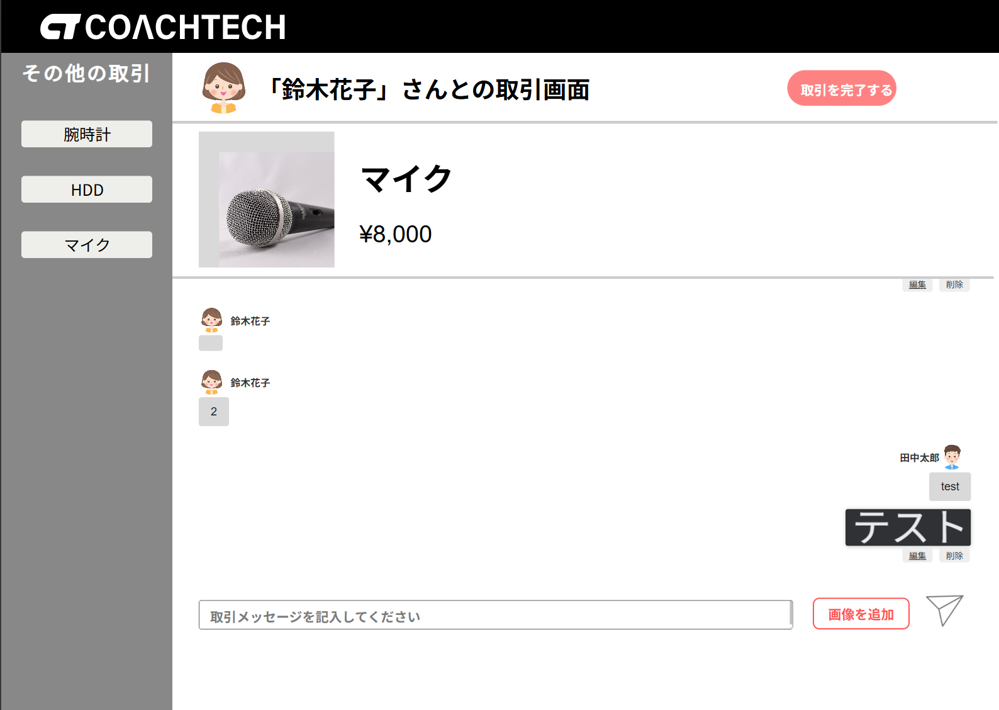
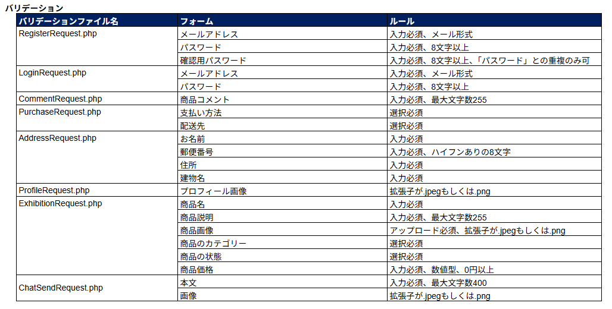

# フリマアプリ

アイテムの出品と購入ができます。
<br>
商品一覧画面（トップ画面）


## 利用者

### 会員登録

ユーザーは、ログインに関係なく、商品一覧画面・商品詳細画面が閲覧できます。
<br>
会員登録後、メール認証によりログインすることができます。


メール認証では、MailHog を使用しております。


初回ログイン時に、プロフィール設定画面でプロフィール設定をします。
<br>
画像は、storage 内の profiles に保存されるようになっています。


プロフィール設定が終わると、商品一覧画面が閲覧できるようになります。
<br>
商品一覧では、自分が出品した商品は表示しないようになっております。
<br>
マイリストでは、「いいね」した商品と検索した商品が表示されます。
<br>
検索欄は、商品の部分一致の検索ができるようになっています。
<br>
購入された商品は、「SOLD」と表示するようになっております。


### 出品

商品出品画面より、商品を登録して出品することができます。
<br>
画像は、storage 内の items に保存されるようになっています。
<br>
カテゴリーでは、複数選択が可能です。
<br>
出品すると、商品一覧画面に切り替わります。


商品一覧画面で、商品をクリックすると商品詳細画面に移動します。
<br>
商品詳細画面では、詳細な出品情報が表示されます。
<br>
ログインユーザーは「いいね」機能、コメント投稿、購入へと進むことができます。
<br>
未ログインユーザーは、商品一覧画面と商品詳細画面の閲覧のみとなります。



### マイページ

マイページ画面では、出品した商品・購入した商品が確認できます。


マイページ編集画面では、初回ログイン時で設定したプロフィールを編集して更新できます。


### 購入

商品購入画面では、金額、支払い方法の選択、配送先の確認ができます。


住所変更画面では、ユーザーが登録している住所が表示され、編集して更新することができます。
<br>
更新された住所は、商品購入画面の配送先に反映して表示されます。


「購入する」ボタンをクリックすると、購入が完了して stripe の決済画面に移行します。


## 環境構築

**Docker ビルド**

1. `git clone git@github.com:taienobutaka/taie-flea-market.git`
2. DockerDesktop アプリを立ち上げる
3. `docker-compose up -d --build`
4. テスト環境で mailhog を使用しています

```bash
version: "3.8"

services:
  nginx:
    image: nginx:1.21.1
    ports:
      - "80:80"
    volumes:
      - ./docker/nginx/default.conf:/etc/nginx/conf.d/default.conf
      - ./src:/var/www/
    depends_on:
      - php

  php:
    build: ./docker/php
    volumes:
      - ./src:/var/www/

  mysql:
    image: mysql:8.0.26
    environment:
      MYSQL_ROOT_PASSWORD: root
      MYSQL_DATABASE: laravel_db
      MYSQL_USER: laravel_user
      MYSQL_PASSWORD: laravel_pass
    command: mysqld --default-authentication-plugin=mysql_native_password
    volumes:
      - ./docker/mysql/data:/var/lib/mysql
      - ./docker/mysql/my.cnf:/etc/mysql/conf.d/my.cnf

  phpmyadmin:
    image: phpmyadmin/phpmyadmin
    environment:
      - PMA_ARBITRARY=1
      - PMA_HOST=mysql
      - PMA_USER=laravel_user
      - PMA_PASSWORD=laravel_pass
    depends_on:
      - mysql
    ports:
      - 8080:80

  mailhog:
    image: mailhog/mailhog
    ports:
      - "1025:1025"
      - "8025:8025"
```

**Docker 環境の設定**

1. Dockerfile を使用して PHP 環境を構築

```bash
FROM php:7.4.9-fpm

COPY php.ini /usr/local/etc/php/

RUN apt update \
  && apt install -y default-mysql-client zlib1g-dev libzip-dev unzip \
  && docker-php-ext-install pdo_mysql zip

RUN curl -sS https://getcomposer.org/installer | php \
  && mv composer.phar /usr/local/bin/composer \
  && composer self-update

WORKDIR /var/www
```

**Laravel 環境構築**

1. `docker-compose exec php bash`
2. php コンテナ内で `composer install`
3. 「.env.example」ファイルを 「.env」ファイルに命名を変更。または、新しく.env ファイルを作成
4. .env に以下の環境変数を追加

```
DB_CONNECTION=mysql
DB_HOST=mysql
DB_PORT=3306
DB_DATABASE=laravel_db
DB_USERNAME=laravel_user
DB_PASSWORD=laravel_pass
```

6. MailHog の設定

```
MAIL_MAILER=smtp
MAIL_HOST=mailhog
MAIL_PORT=1025
MAIL_USERNAME=null
MAIL_PASSWORD=null
MAIL_ENCRYPTION=null
MAIL_FROM_ADDRESS=from@example.com
MAIL_FROM_NAME="${APP_NAME}"

```

7. アプリケーションキーの作成

```bash
php artisan key:generate
```

8. マイグレーションの実行

```bash
php artisan migrate
```

9. シーディングの実行

```bash
php artisan db:seed
```

**Stripe（テスト環境）の設定**

1. Stripe のインストール<br>
   Stripe の PHP ライブラリをインストール

```
composer require stripe/stripe-php
```

2. 環境設定ファイルの更新<br>
   `.env`ファイルに Stripe の API キーを追加

```
STRIPE_KEY=your_stripe_key
STRIPE_SECRET=your_stripe_secret_key
```

## 使用技術(実行環境)

- PHP 8.1.31
- Laravel 8.83.29
- MySQL 8.0.26

## ER 図



## テーブル仕様



## 機能一覧


## 基本設計




## URL

- 開発環境：http://localhost/
- phpMyAdmin:：http://localhost:8080/
